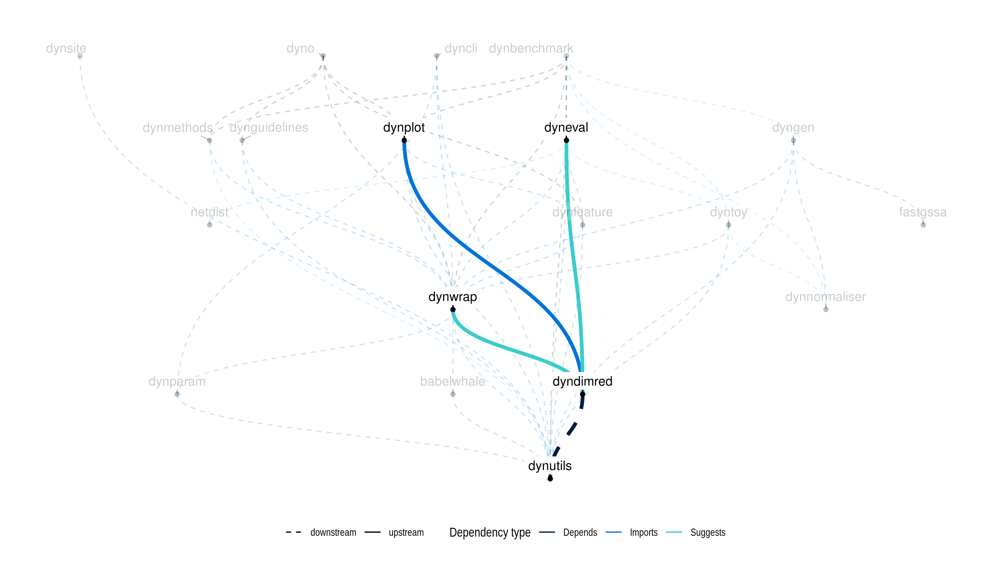

dyndimred
================

<!-- badges: start -->

<!-- badges: end -->

[**ℹ️ Tutorials**](https://dynverse.org)

# `dyndimred`: Dimensionality Reduction Methods in a Common Format

Provides a common interface for applying dimensionality reduction
methods, such as PCA, ICA, diffusion maps, LLE, t-SNE, and umap. Just
plug in a matrix and get a dimensionality reduction!

## Latest changes

Check out `news(package = "dyndimred")` or [NEWS.md](NEWS.md) for a full
list of changes.

<!-- This section gets automatically generated from inst/NEWS.md, and also generates inst/NEWS -->

### Recent changes in dyndimred 1.0.4

-   MINOR CHANGES: Check package is installed before running unit tests.

-   MINOR CHANGES: Remove `dynutils::install_packages()`.

### Recent changes in dyndimred 1.0.3

-   MINOR CHANGES: The code for landmark mds has been moved to its own
    separate package, `lmds`.

-   MINOR CHANGES: Change license to MIT.

-   MINOR CHANGES: Fix `dynutils::install_packages()` such that it
    prompts the user whether or not to install packages when in
    interactive mode, and simply returns an error when not in
    interactive mode.

## Dynverse dependencies

<!-- Generated by "update_dependency_graphs.R" in the main dynverse repo -->

